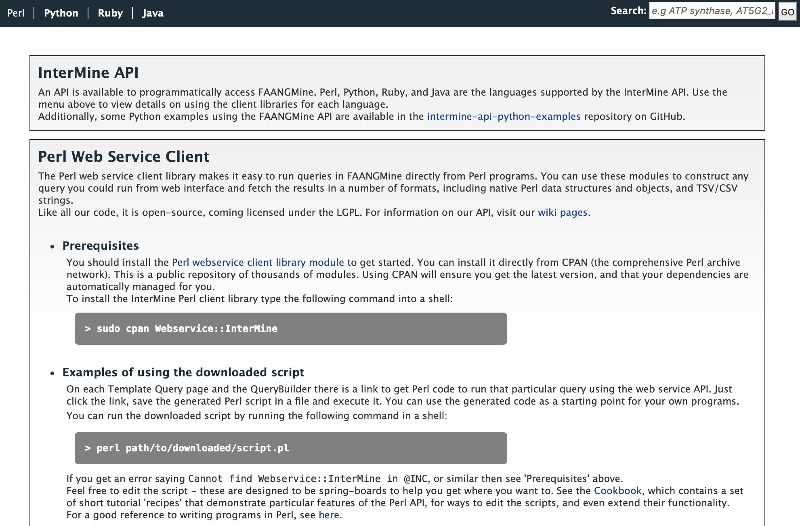

API
===

An API is available for users who would like to programmatically access FAANGMine.

  
  FAANGMine API page

..

Perl, Python, Ruby, and Java are the languages supported by the InterMine API. Several Python examples for FAANGMine are available on GitHub `here <https://github.com/elsiklab/intermine-api-python-examples/tree/main/faangmine>`_.

For more detailed information, view the `InterMine documentation <https://intermine.readthedocs.io/en/latest/web-services>`_.
