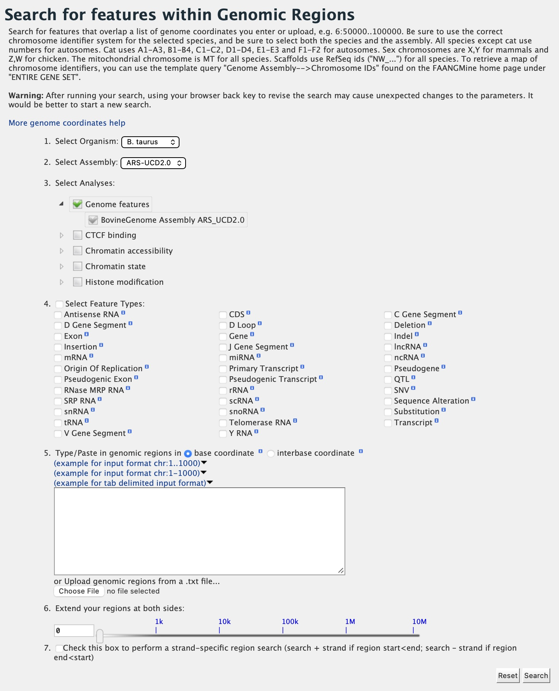
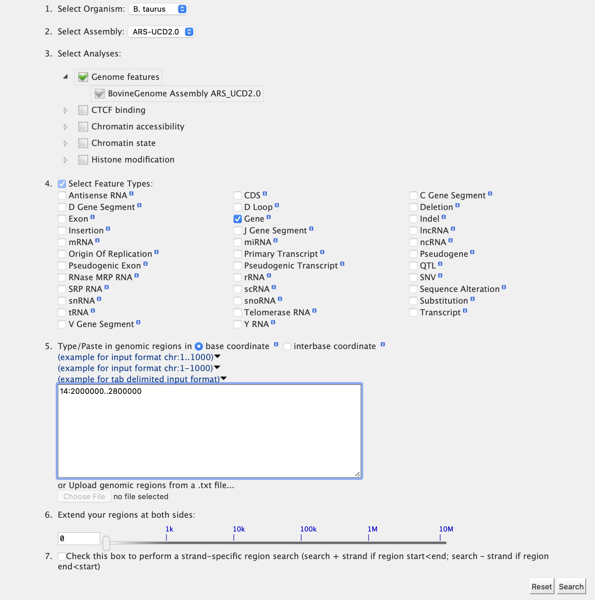
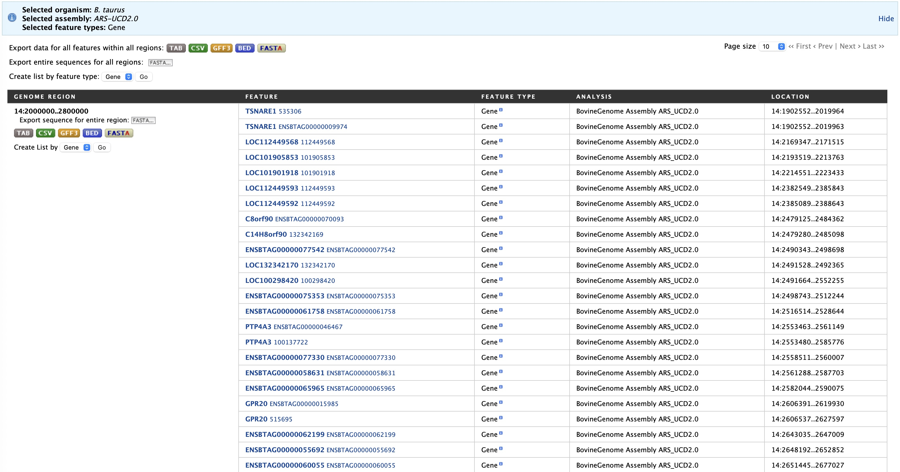

Genomic Regions Search
======================
The **Genomic Regions Search** is a tool to fetch features that are within a given set of genomic coordinates or are within a given number of bases flanking the coordinates.

To begin this type of search, click the **Regions** tab on the menu bar. A form will appear asking for the search parameters (organism, feature types, genomic coordinates, etc.)

   
   Genomic Regions search form
   
..

The coordinates must have one of three formats:

1. chromosome_number:start..end
2. chromosome_number:start-end
3. chromosome_number	start end (tab delimited)

Click on the input examples above the text input box (number 5) to view a representative set of coordinates in each format. Click the **More genome coordinates help** link near the top of the form for more detailed information on the input format requirements.

During a search, regions may be extended on either side of the genomic coordinates using the slider or by entering text in the field to the left of the slide bar. There is also the option to perform a strand-specific region search using the checkbox at the bottom of the form (number 7).

As an example, select *B. taurus* from the Select Organism drop-down, and ARS-UCD2.0 as the Assembly. Leave Genome Features checked as the analysis (default option). Under Select Feature Types, check the box next to Gene, and enter the following coordinates into the genomic regions search text field:

::

	14:2000000..2800000

..

Click the search box to conduct the genomic regions search.  If there are no overlaps within your search coordinates, the search can be done again with the search region extended using the slide bar or entering text into the search box (e.g., 10k).

   
   Genomic Regions search example with *Bos taurus*
   
..

The search results page displays a table of features present within the genomic interval that was searched. In this case, the feature type was limited to Gene. The results may be exported as tab-separated or comma-separated values. If they contain genomic features, there is also the option to saved the results in GFF3 or BED format. The FASTA sequences of the features may also be downloaded.  Links within the features provide detailed reports.  If users are interested in creating a list of particular features from the result page then they can filter based on feature type (if applicable), shown in red box, and click on **Go**.

   
   Genomic Regions search results

..

