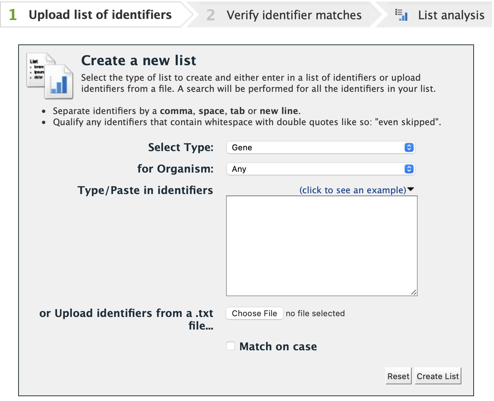
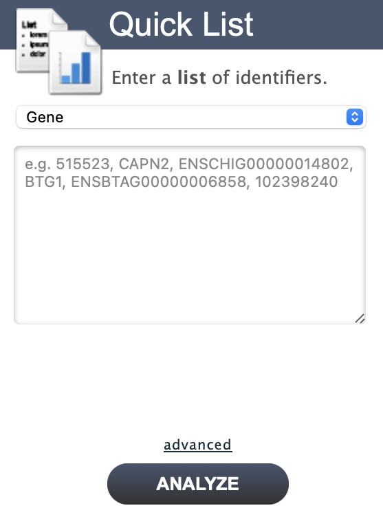
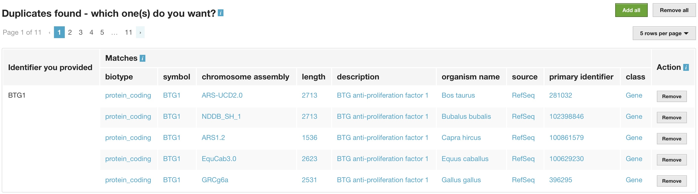
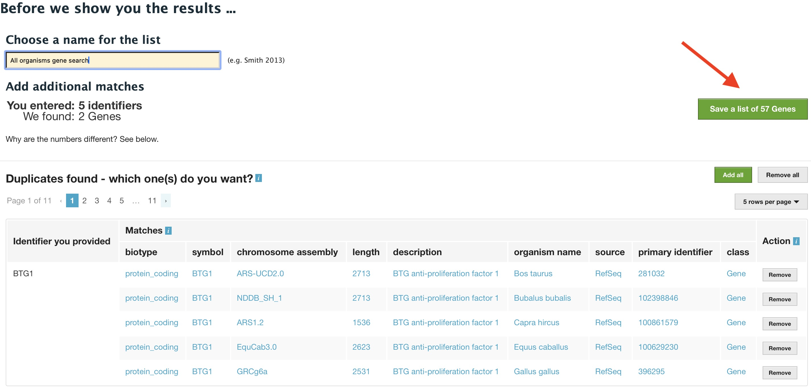
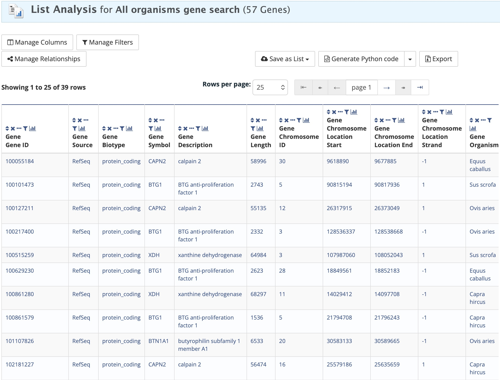
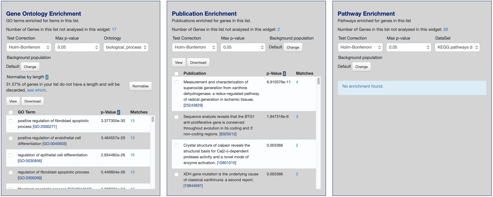
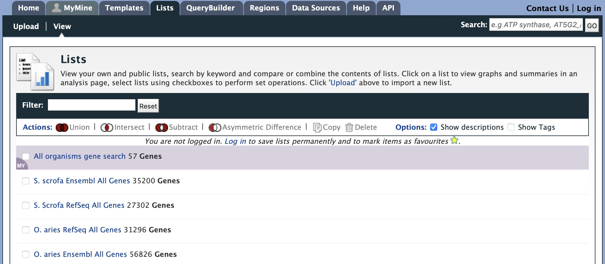

Lists
=====

Creating Lists
~~~~~~~~~~~~~~
Users may create and save lists of features, such as gene IDs, transcript IDs, gene symbols, etc. The list tool searches the database for the list items and attempts to convert each identifier to the selected type. Click on the Lists tab from the menu to access the full list upload form. A short version of the form is also in the Quick List box on the home page.

   
   List upload form
   
..

   
   Quick list from FAANGMine home page
   
..

As an example, enter the following comma-separated identifiers into the Lists upload form under the **Lists** tab.  Notice that they do not have to be in the same format.  A Summary table is displayed with the results of searching for each of the five identifiers in the list.

::

	CAPN2, ENSCHIG00000014802, BTG1, XDH, 101107826

Leave the **Select Type** drop-down menu to **Gene** and the **Organism** drop-down to **Any**.  Click on **Create List**.  Note that you can also upload a list from a .txt file.

   
   List Example: Search results for list of identifiers
   
..

The summary table provides information regarding those identifiers that had a direct hit without any duplicates.  If there are any duplicates, users can decide to add the relevant entries individually by clicking on the **Add** button under the **Action** column or choosing the **Add all** tab.  Here we will click **Add all**.  Once the selections have been added, the list can be saved by clicking the **Save a list of 66 Genes** button on the top of the summary table.  Name the list by entering text into the **Choose a name for the list** box at the top of the results page.

   
   List Example: Saving list of identifiers
   
..

After the list is saved, users are presented with a **List Analysis** page.  This page provides users with widgets to perform analyses on gene lists that they have created.

   
   List Example: Analysis for gene list
   
..

The available widgets are Gene Ontology Enrichment, Publication Enrichment, and Pathway Enrichment. Read the **Important Notes for Enrichment Widgets** for special instructions to avoid false positives.

   
   List Example: Displayed widgets for list analysis
   
..

Saving Lists
~~~~~~~~~~~~
To see your saved lists, click the **View** tab on the **Lists** page.  If not logged in, lists will be saved temporarily during your current session. However, you must be logged in to save your lists permanently.  Further analyses of lists can be done with the **Actions** links at the top of the list. The links become active once lists are selected for analyses.  Saved lists may also be accessed from the **MyMine** menu tab.

   
   List Example: Saved user lists
   
..
