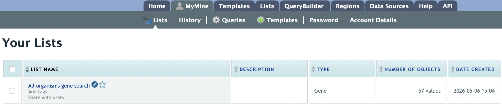

MyMine
======

MyMine serves as a portal where logged-in users may manage their lists, queries, templates, and account details.

To access MyMine, click on the MyMine menu tab. A submenu appears with six options:

**Lists** - Lists saved by the user when logged in.

**History** - List of most recently run queries.

**Queries** - List of saved queries.

**Templates** - Templates created or marked as “favorite” by the user.

**Password** - Password reset form.

**Account Details** - User preferences form.

   
   Saved lists found under MyMine.  Note that currently saved lists can be selected for analyses to contribute to new lists. 

..