Navigation and Searching in FAANGMine
======================================

.. role:: raw-html(raw)
    :format: html
.. |rightArrow| unicode:: U+2B95

There are several ways for users to query FAANGMine.

Quick Search
~~~~~~~~~~~~

**Quick Search** allows users to search keywords from any of the FAANGMine datasets. There is a Quick Search box on the FAANGMine home page or a smaller search box in the upper right corner of all pages.

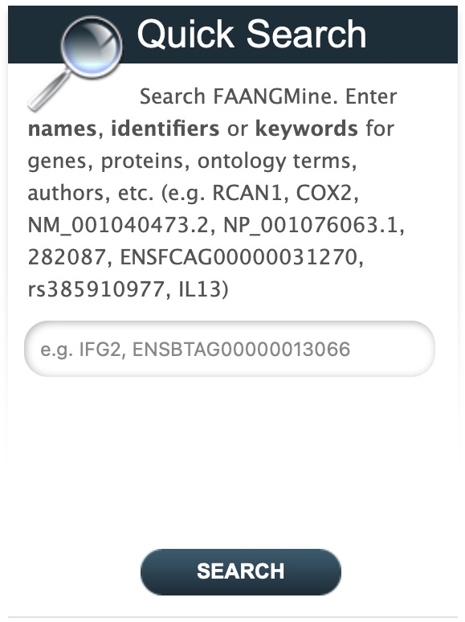
   
   Quick Search from home page

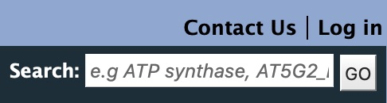

   Quick Search from any page
   
..

Quick Searches can be conducted with a number of identifiers including gene names, transcripts, pathways, gene identifiers or organisms.  The wildcard character `*` can be used to retrieve all results that match a particular search query.  

For an example, we will use the lysozyme gene *LYZ* as an example. Enter LYZ in the search box and click **Search**. The results page is tabulated and displays a summary about your query, as shown below.

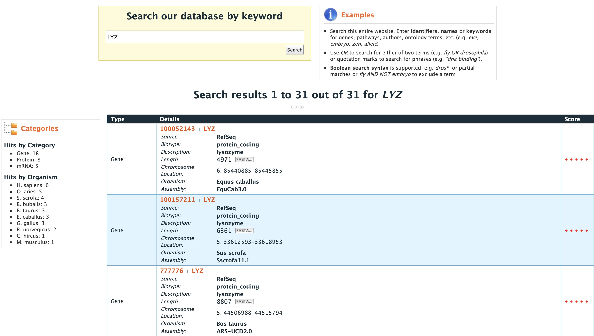

   Results table for Quick Search with the gene *LYZ*

..

Hits are summarized in the box to the left of the results tables and can be filtered based on **Category** and **Organism**.  Clicking on any of them will filter by the selected category.  Note that for results with sequence data available, the sequence can be downloaded in FASTA format by clicking on the FASTA box within the hit Details box.  The score column in the result table indicates the similarity of your query to each of the hits. The results page can also be converted to a list (and saved if users are logged in). To enable this feature click on **Gene** in the **Hits by Category** then click on *O. aries* in **Hits by Organism**.

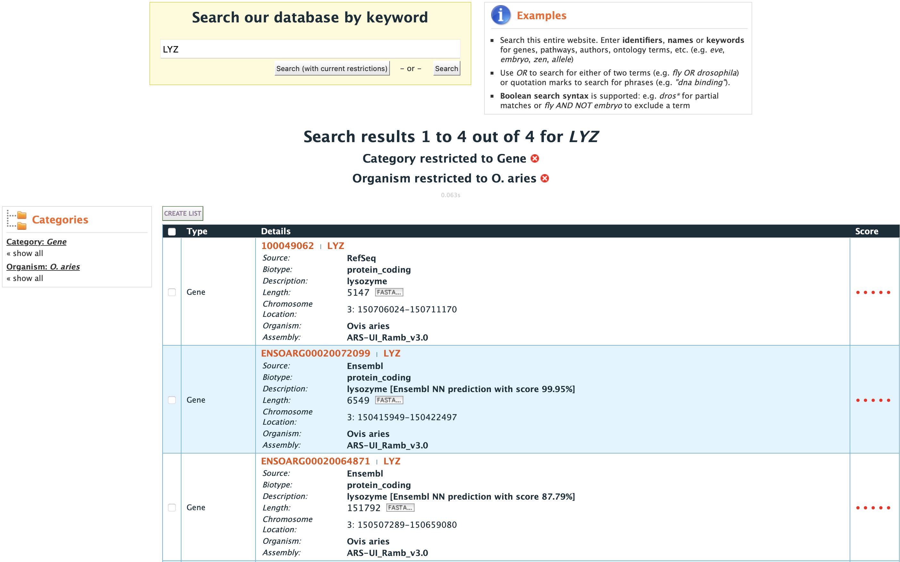
   
   Results table for Quick Search with the gene	*LYZ* filtered by gene then by organism
   
..

After the table has been filtered for gene and organism, checkboxes will be available for users to select genes they would like to add to their list. Once the genes are selected, click on **CREATE LIST**.  See the lists section for more detail on creating and saving lists.  

.. _templates: 

Templates
~~~~~~~~~

**Templates** or predefined queries are another search method within FAANGMine.  Popular templates are displayed on the home page, grouped by category (e.g., Genes, Proteins, Expression) and the complete list can be seen by clicking the **Templates** menu tab.

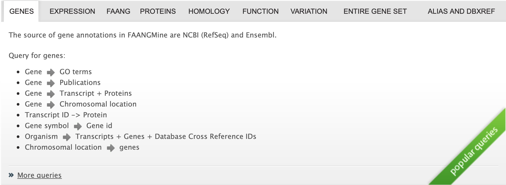

   Popular templates

..

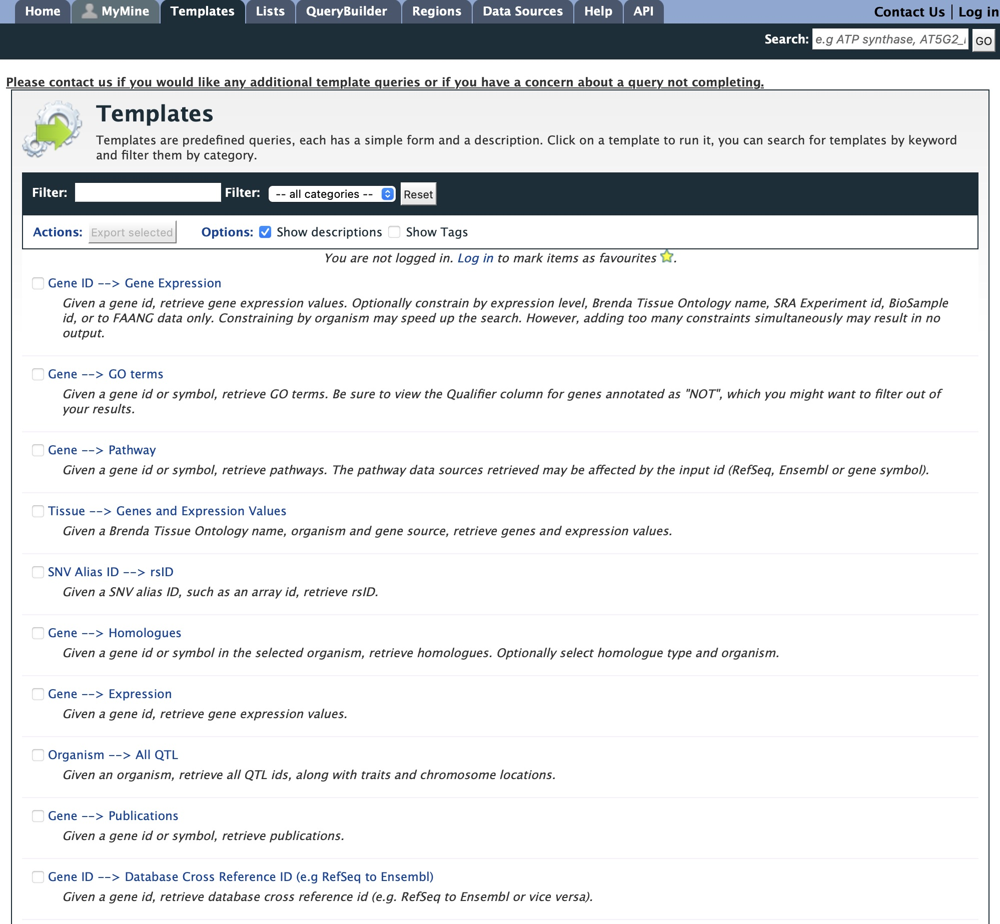

   Full list of templates on Templates page

..

As an example, the **Gene -> Homologues** template queries FAANGMine to retrieves all homologue for a given gene.  Here, we will do a search for the gene *GSTM1*.

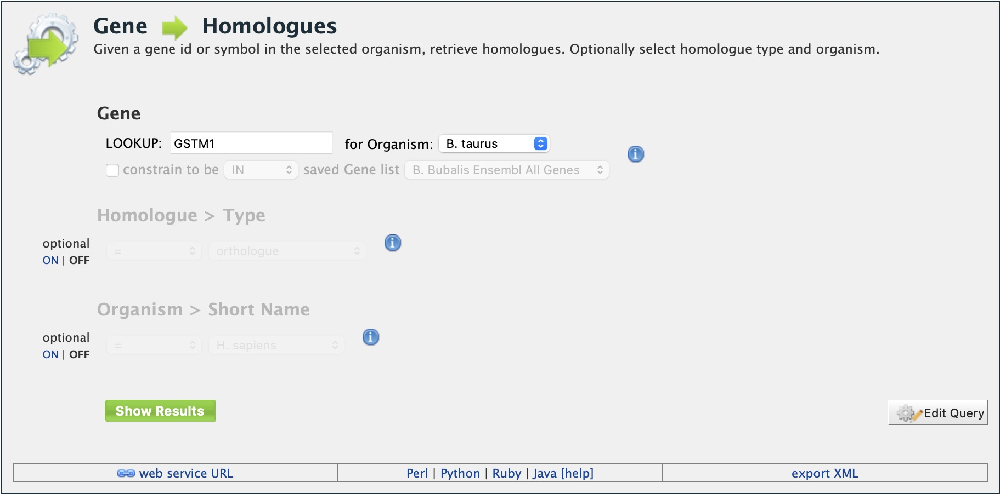

   Example: Gene |rightArrow| Homologue

..

The results page displays all of the homologues for that query gene.  When logged in to FAANGMine, users can save their results as a list for further analyses by clicking on the **Save as List** button above the results table then choosing columns to save in their list.  See the lists section for more detail on creating and saving lists.  Note the "Trail: Query" text at the upper left of the results table.  Clicking on the "Query" link will bring you back to the query that generated the table to allow for edits without having to start with a new template.

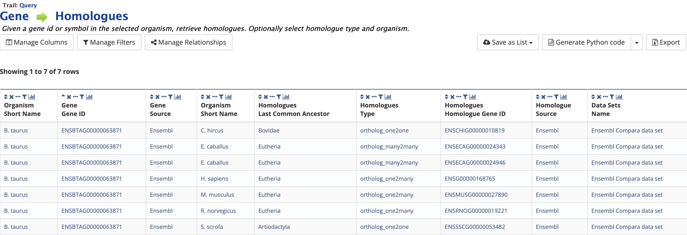

Example: Gene |rightArrow| Homologue template search results, identifier for Gene GSTM1

..

Generate query code
-------------------
The code for each template query can be retrieved by clicking on the arrow next to **Generate Python Code** and choosing the desired language from the pull-down menu. The language options are Python, Perl, Java, Ruby, JavaScript, and XML.

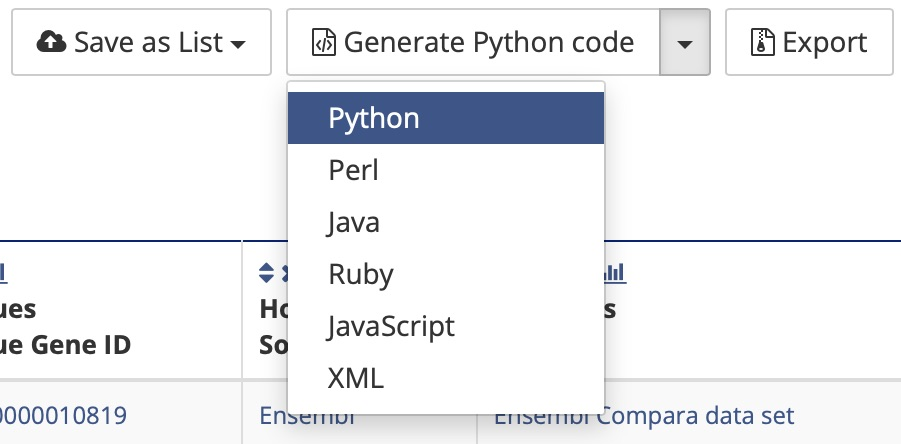

   Options for generating code from template query

..

Download results
----------------
The search results from a template query can be downloaded by clicking the **Export** button above the table and choosing the desired format from the pull-down menu to the right of the File name field. Available formats are tab-separated values, comma-separated values, XML, and JSON. When the results contain genomic features, they may also be downloaded in FASTA, GFF3, or BED format. Other options may be specified in the submenu to the left of the download box. By default, all rows and all columns are downloaded, but individual columns may be included or excluded by clicking on the toggles next to the column headers in the **All Columns** submenu. The number of rows and row offset are set in the **All Rows** submenu. Download the results as a compressed file by choosing GZIP or ZIP format in the **Compression** submenu (default is **No Compression**). Column headers are not added by default but may be included under the **Column Headers** submenu. Finally, the **Preview** submenu displays the first three rows of the file to be downloaded so that the desired format and options may be finalized before beginning the download. When ready, click the **Download file** button to download the results.

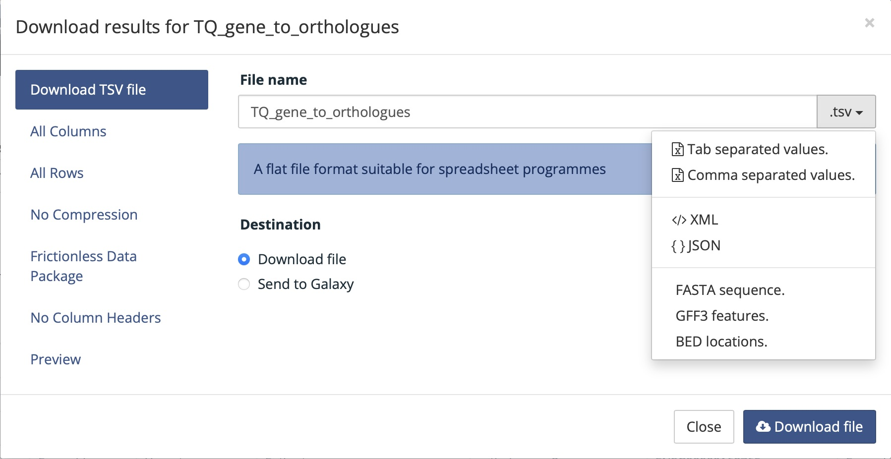

   Options for downloading results from template query

..

.. _Customize output:

Customize output and manage columns
-----------------------------------

To customize the results table layout, click the **Manage Columns** button.  This allows users to rearrange, remove or order columns.  Filters can be edited  by clicking the **Manage Filters** button.  To specify the entity relationships within the query and change the way the results are presented in the table, click **Manage Relationships**.  Clicking on the **Manage Relationships** option bring also brings up a blue information panel ("What does this do?") that provides more detailed information.

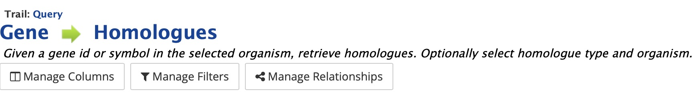

   Options for customizing the results of a template query.

..

To further manage column data, each column has a set of icons in its header.  Mousing over any icon will reveal what it does. The sort icon resembles two triangles and allows you to sort a column in either direction (ascending/descending; a->z, z->a).  To delete any column from your table, click on the "x" icon.  Alternatively, the three dots "..." can be selected to "Toggle column visibility" and hide the column.  Once hidden, the icon turns into a double arrow that can be selected to expand the column into its original form.  The next icon resembling a funnel can be selected to edit or remove any currently active filters.  A summary of the data within a column can be viewed by clicking on the icon that resembles a graph.  The data within each summary can be selected for further filtering or downloading.

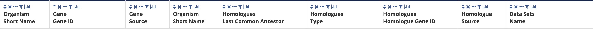

   Column header icons available to edit the results of a template query.

..

Optional filters
----------------
**If you are using a template with an optional filter and want to edit the template, the "Query" link at the top left of the results page is not functioning properly. Additionally, if you click on "Edit Query" in a template, the optional settings becomes non-optional and the default constraint is applied. To edit the template query, navigate back to the template by using the "Templates" tab on the home page menu bar.**

Some templates have optional filters that are disabled by default. For the **Gene** |rightArrow| **Human Homologues** |rightArrow| **Human Pathways** query, there is an optional filter to specify the homologue type used in the query.  To enable the filter, click **ON** below the **Homologue > Type** label.

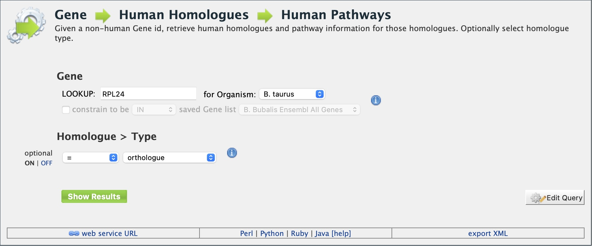

   Using the optional homologue type filter in the Gene |rightArrow| Human Homologues |rightArrow| Human Pathways query template.

..

QueryBuilder
~~~~~~~~~~~~

The provided templates are suitable for many different types of searches, new queries may be built from scratch using the **QueryBuilder**. The possibilities of queries using the QueryBuilder are endless. The output may be formatted exactly as desired, and the query constraints may be chosen to perform complex search operations.

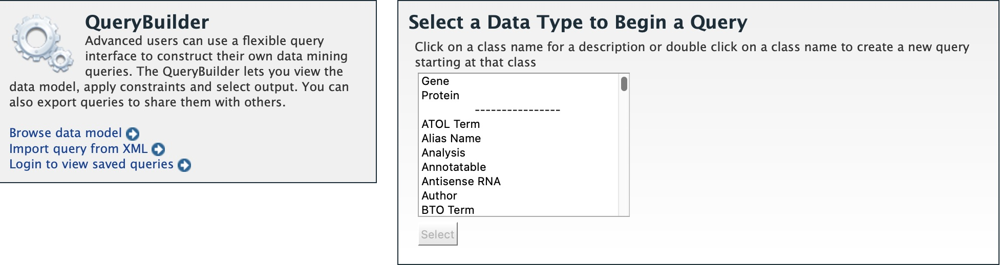
  
   QueryBuilder main menu 
..
  

To begin, select a **Data Type**. For example, select **Gene** as a Data Type then click the **Select** button to be taken to the Model browser. 

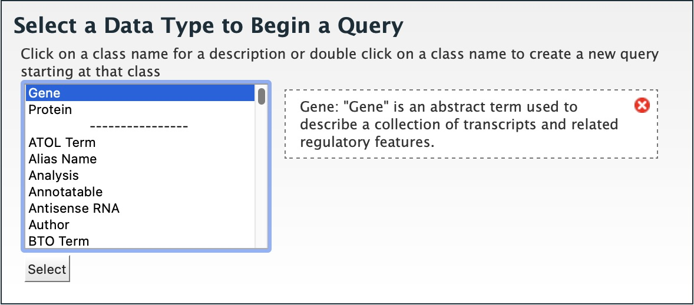
   
   Selecting data type as **Gene** in QueryBuilder.
   
..

Model browser
-------------
After selecting a data type, the **Model builder** appears displaying the attributes for the chosen feature class **Gene**.

First let's select ``Gene`` as a Data Type in the QueryBuilder. Then click on ``Select``. This will take you to a Model browser where you can select the attributes for the feature class ‘Gene’, which you would want to be shown in your results.

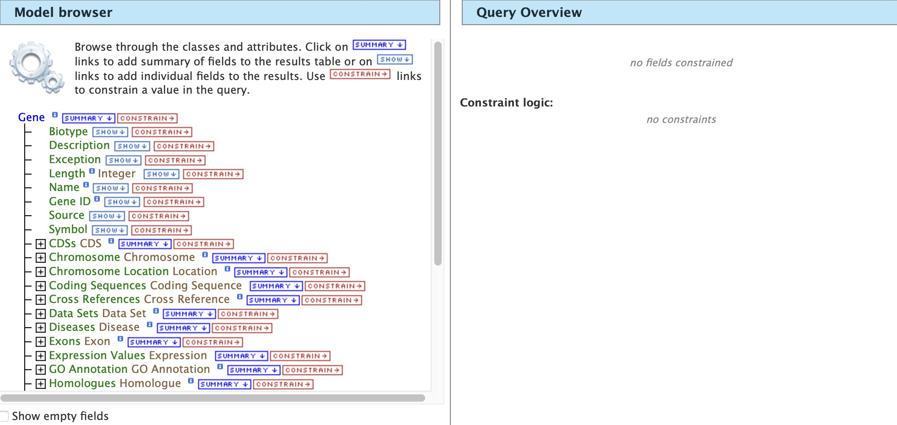

   Model browser with "Gene" selected as the data type.
   
..

QueryBuilder Examples
---------------------

The following three examples provide details as to how to use the QueryBuilder using "Gene" as the selected data type.

Example 1:  Querying for protein coding genes
^^^^^^^^^^^^^^^^^^^^^^^^^^^^^^^^^^^^^^^^^^^^^

In the Model browser, click **Show** next to **Biotype**, **Gene ID** and **Symbol**, which will add these fields to the query.  Notice that these two fields appear below the data type **Gene** in the Query Overview section. They also appear below the Model Browser in the section labeled **Fields selected for output**.

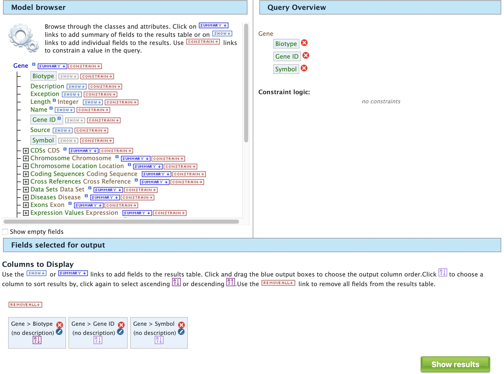
   
   Example 1, Step 1: Select fields to be added to the query   

..

Then click **Constrain** next to **Biotype**. The first drop-down menu defaults to `=` (equals sign). In the second drop-down menu, select **protein_coding**, then click the **Add to query** button. This adds a constraint to the query to search only for protein coding genes. Notice that the Query Overview section now shows "Biotype = protein_coding". Also, two types of icons appear next to the attributes. Clicking on the red "X" icon next to an attribute will remove that field or constraint from the query. Clicking on the blue pencil icon next to a constraint brings up the constraint editing window where changes may be made to the query filters.

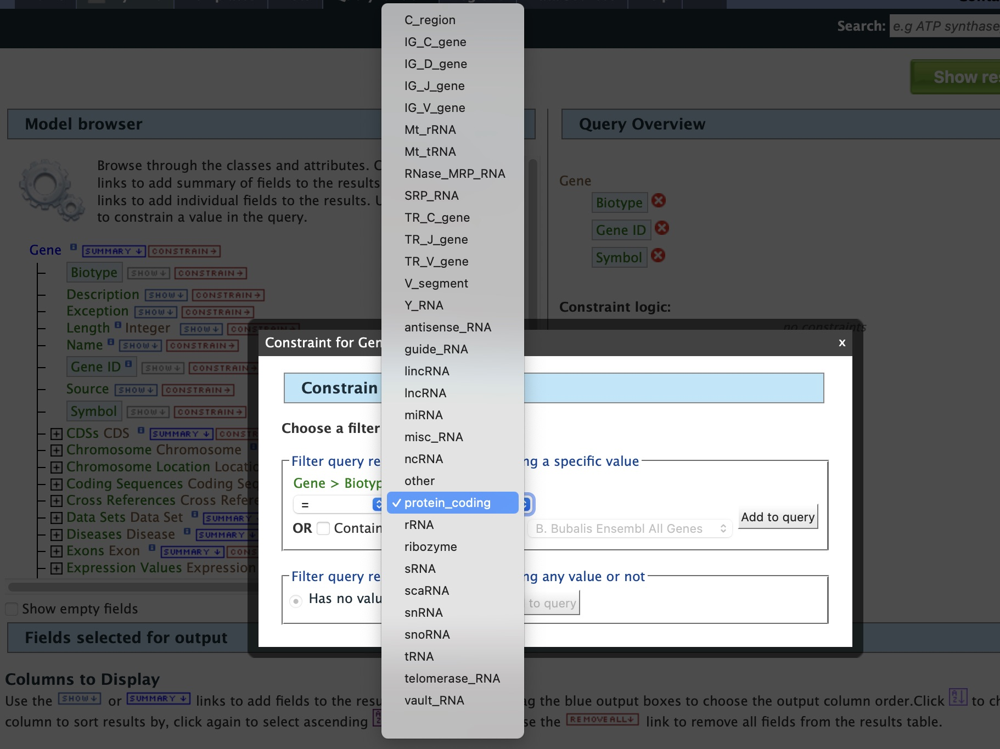

   Example 1, Step 2: Adding a constraint to the query on Biotype.

..   

Lastly, click on **Show Results** above the Model Browser.  The resulting table contains all protein coding genes in the database, with Gene ID, Gene Symbol and Gene Biotype as the table columns.  Because the Biotypes should all be the same (protein coding), that column can be deleted by clicking the "x" above it. Alternatively, the three dots "..." can be selected to "Toggle column visibility" and hide the column. See the :ref:`Customize output` section to review ways to manage column data.

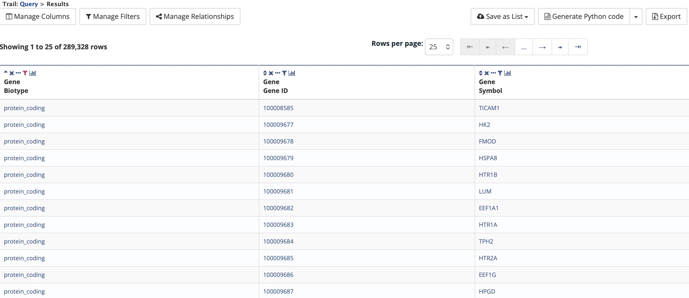

   Example 1, Step 3: Display query results.

..

Example 2:  Querying for protein coding genes on a particuler chromosome
^^^^^^^^^^^^^^^^^^^^^^^^^^^^^^^^^^^^^^^^^^^^^^^^^^^^^^^^^^^^^^^^^^^^^^^^
Users can customize the previously run query by adding another constraint for **Chromosome**.  Note the "Trail: Query" text at the upper left of the results table. Clicking on the "Query" link will bring you back to the query that generated the table to allow for edits without having to build a new query.  In the Model browser, click on the "+" (plus sign) next to the Chromosome feature class to display its attributes.

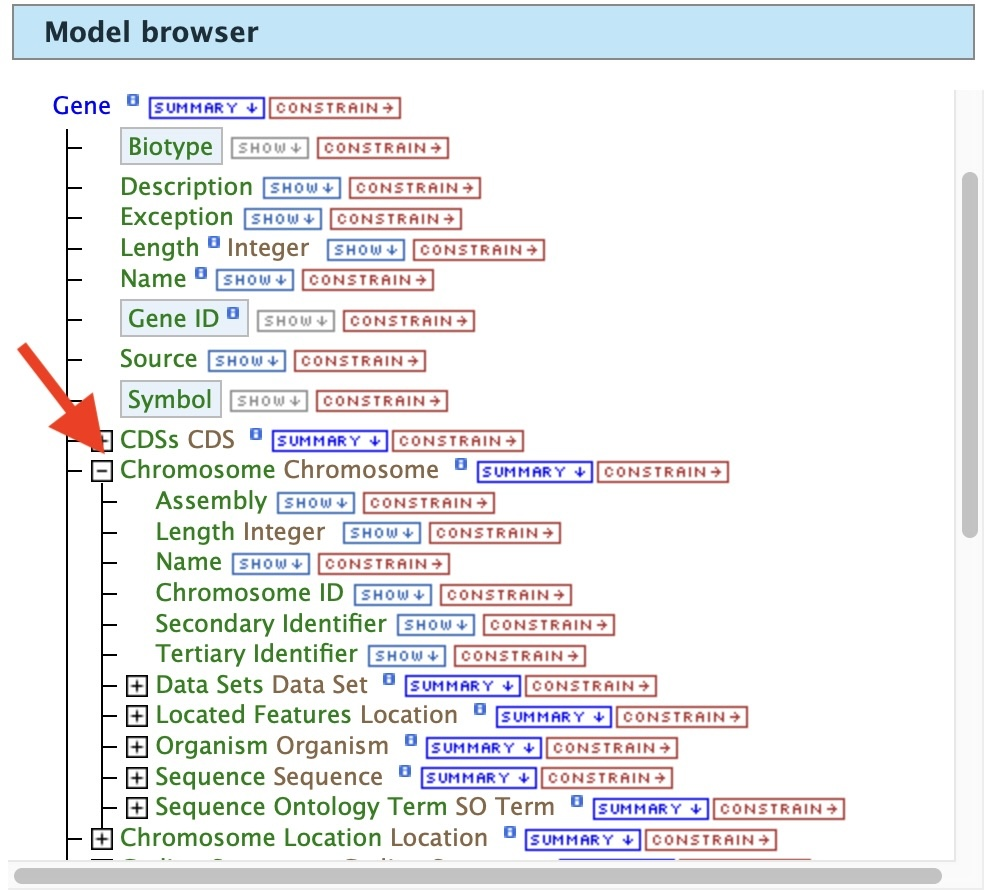

   Example 2, Step 1: View attributes of Chromosome feature class

..

Next click on **Constrain** next to the  **Chromosome ID** attribute and in the text box of the pop-up window select "=" (equals).  Enter **18** for chromosome number 18; then click **Add to Query**, which adds the additional constraint to the query. Just restricting the query to chromosome 18 will bring up that chromosome in multiple organisms, so we will add another constraint to limit the results to *Equus caballus* genes. Click on the **Organism** to reveal its attributes; then click on **constrain** next to Name.  In the resulting pop-up window, slect "=" (equals) then choose "Equus caballus" from the dropdown menu.

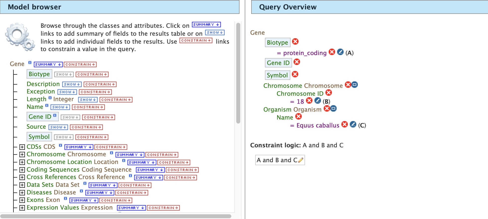

   Example 2, Step 2: Adding constraints to the Chromosome ID and Organism

..

Click on **Show results** and the query will result in all protein coding genes on the Chromosome with constrained ID and organism.  Note that the number of results has been reduced with the addition of these constraints.

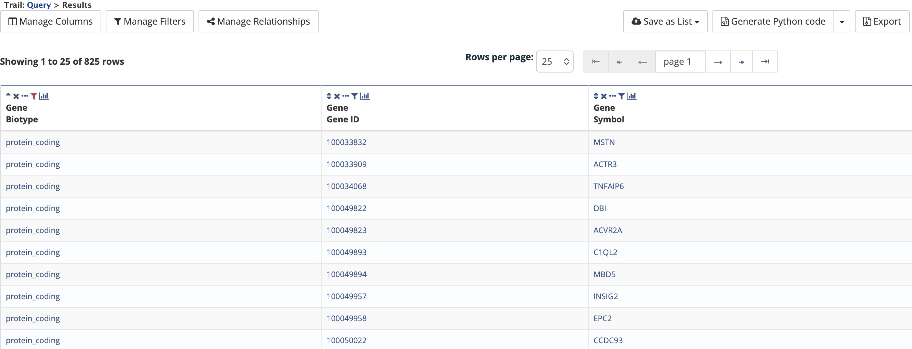

   Example 2, Step 3: Result table after constraining by Chromosome ID and Organism

..

Example 3: Querying for Protein Coding genes on a particular chromosome and their exons
^^^^^^^^^^^^^^^^^^^^^^^^^^^^^^^^^^^^^^^^^^^^^^^^^^^^^^^^^^^^^^^^^^^^^^^^^^^^^^^^^^^^^^^^

This last example builds upon the previous queries to display all exons for each gene on a particular chromosome.  Again, note the "Trail: Query" text at the upper left of the results table. Clicking on the "Query" link will bring you back to the query that generated the table to allow for edits without having to build a new query.  Scroll down to **Exon** feature class and select the "+" (plus sign) next to Exons to display its attributes.  Click **Show** next to **Length** and **DB Identifier**.

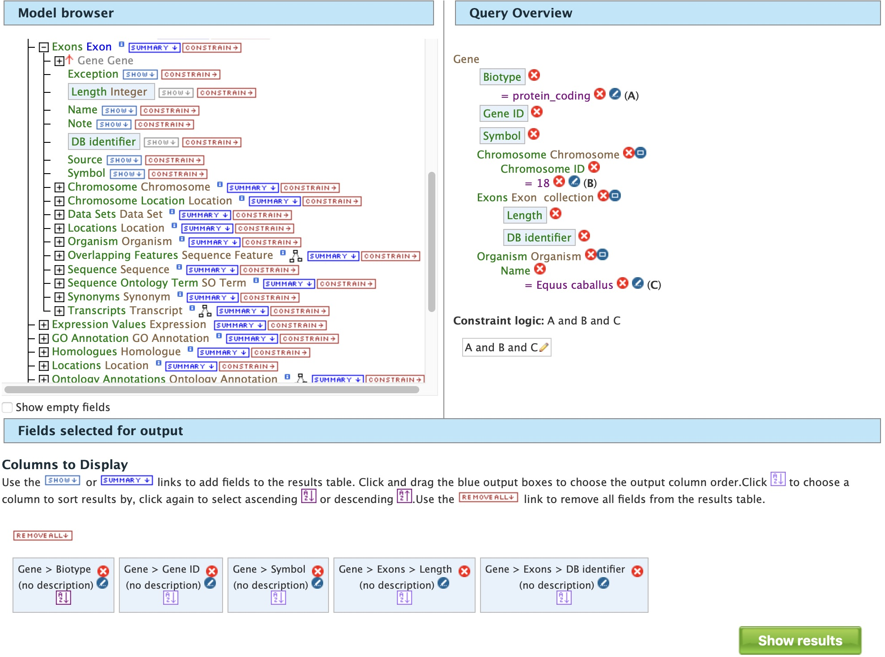

   Example 3, Step 1: Expand exon attributes and add fields to the query

..

The Query Overview shows the query in progress with the selected fields. Also notice that a third type of icon, a blue square, appears next to some attributes. Clicking on a blue square icon brings up a window where the query Join Style may be modified. When adding a constraint, you can decide whether you want to show only those results with the information (genes with exons) or all results and the constrained feature if it exists (e.g., all genes and indicate exons if they exist).  Click on the blue square icon next to **Exon collection** to bring up the Switch Join Style window. The default option is to show only Genes if they have a exon (inner join). Change this to **Show all Genes and show Exons if they are present** (outer join) then click **Add to query**.

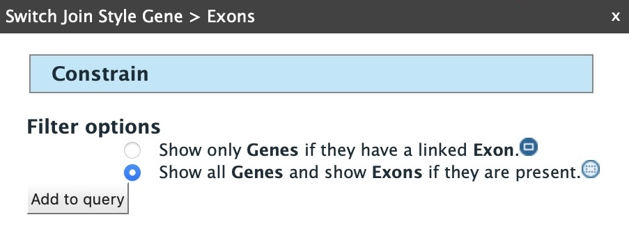

   Example 3, Step 2: Select join style for exons

..

Then click "Show results" to run the new query.

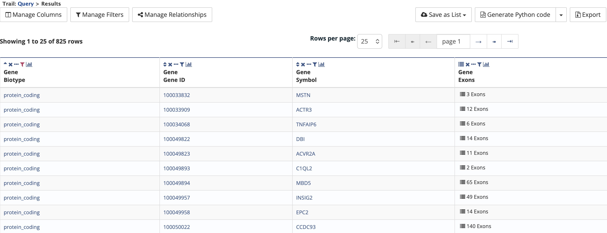

   Example 3, Step 3: Query results with exon constraint

..

The results table now lists a new column **Gene Exons**, which we added to the query.  If we look at the second row in the table, it lists 12 exons.  Click on the **12 exons** link to expand that entry.  That column now has additional rows containing the **Exon identifier** and **Length** for each of the 12 exons.

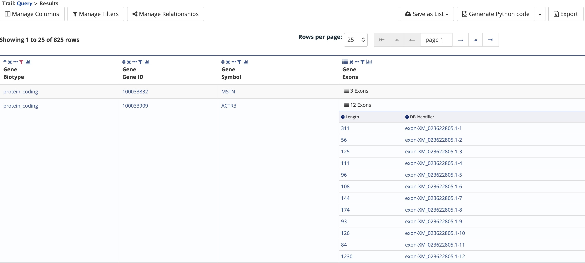

   Example 3, Step 4: Query results with exon column expanded

..

In changing the join style to an outer join, the exons have been grouped together by gene making it easier to determine how many exons are contained in each gene. If the same query is run with the default join (outer join) of **Show only Genes if they have an Exon**, the results table adds a new row for each new exon rather than grouping exons by gene.

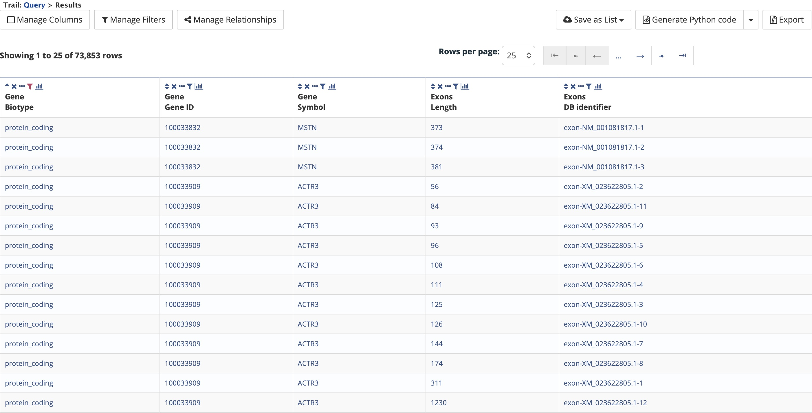

   Example 3, Step 5: Query results with default join style run for genes containing exons

..
